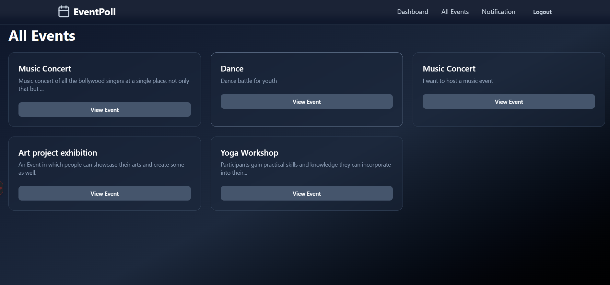
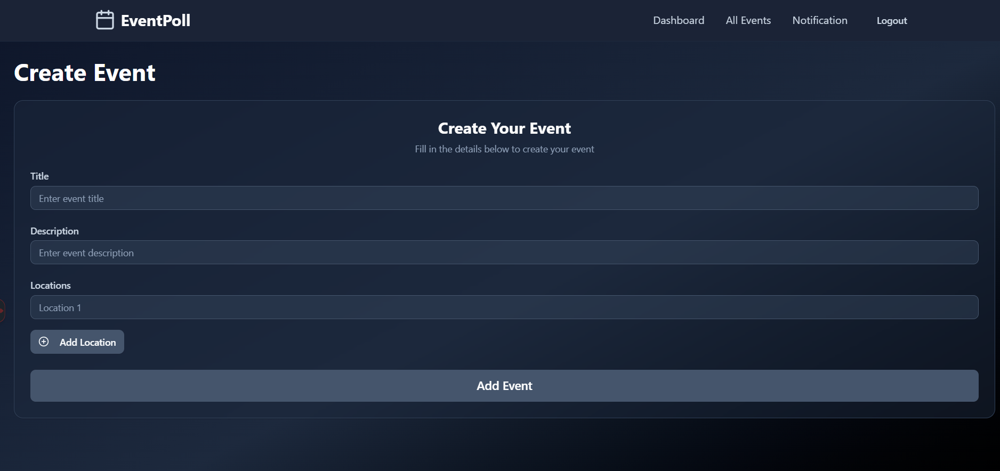
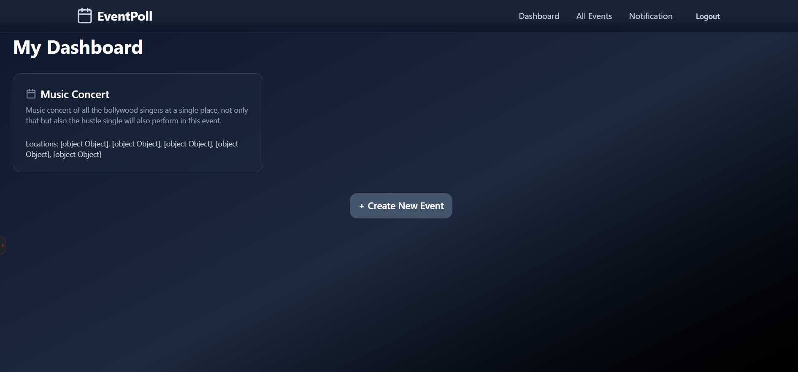
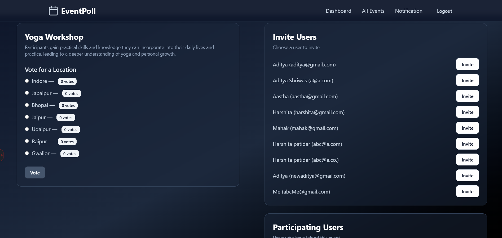
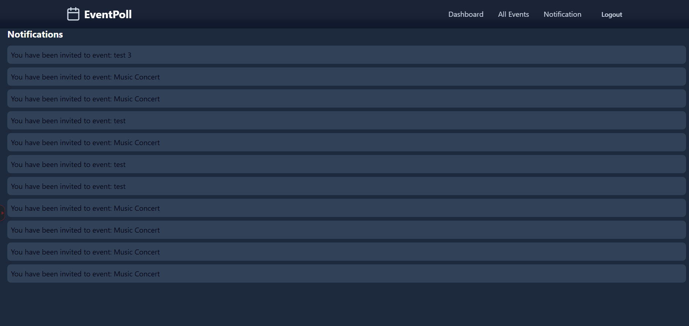
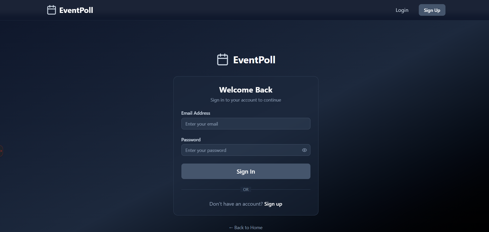
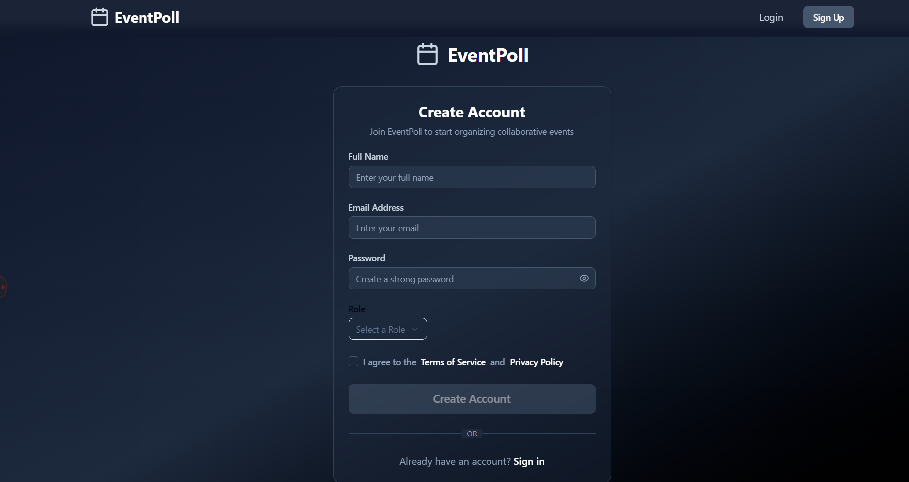

# EventPoll - Collaborative Event & Polling Platform

A full-stack MERN application that simplifies event planning through collaborative polling. Users can create events with multiple date options, invite participants, and let everyone vote on their preferred schedule.

## 🚀 Live Demo

- **Frontend**: [https://collaborative-event-polling-platfor.vercel.app/](https://collaborative-event-polling-platfor.vercel.app/)
- **Backend API**: [https://collaborative-event-polling-platform.onrender.com](https://collaborative-event-polling-platform.onrender.com)

## 🛠️ Tech Stack

### Backend
- **Node.js** & **Express.js** - Server framework
- **MongoDB** with **Mongoose** - Database and ODM
- **JWT** - Authentication
- **bcryptjs** - Password hashing
- **CORS** - Cross-origin resource sharing

### Frontend
- **Next.js 15** (App Router) - React framework
- **ShadCN/UI** - Component library for rapid development
- **Tailwind CSS** - Styling
- **Lucide React** - Icons

## 📁 Project Structure

```
collaborative-event-polling-platform/
├── backend/
│   ├── models/
│   │   ├── User.js
│   │   └── Event.js
│   ├── controllers/
│   ├── routes/
│   ├── middleware/
│   └── index.js
├── frontend/
│   ├── app/
│   │   ├── login/
│   │   ├── signup/
│   │   └── dashboard/
│   ├── components/
│   │   ├── ui/ (ShadCN components)
│   │   └── custom/
│   └── lib/
└── README.md
```

## 🎯 My Approach & Thinking

### 1. **Database Design Strategy**

When I started thinking about the data structure, I realized this wasn't just a simple CRUD app. The key challenge was handling the relationship between users, events, and voting systems efficiently.

**My approach was:**
- **Embedded vs Separate Collections**: Instead of creating separate tables for polls and votes, I decided to embed the polling data directly into the Event schema. This made sense because polls are tightly coupled with events and this approach reduces database queries.
- **Vote Tracking**: For each date option, I store both `voteCount` (for quick display) and `votedBy` array (for validation and preventing duplicate votes).
- **Invitation System**: I used a hybrid approach - storing invitations in the Event's `participants` array for efficient dashboard queries.


**Why this approach?** 
- Fewer database joins
- Real-time vote counting
- Easy validation (check if user already voted)
- Perfect for the 2-day timeline

### 2. **Frontend Architecture Decisions**

Coming from a backend background, I initially thought about using Redux for state management, but then I realized something important.

**My thought process:**
- **Skip Redux**: For this project scope, Redux would be overkill and eat up precious development time. The app only needs to track user authentication state and temporary form data.
- **Choose ShadCN over Building from Scratch**: Instead of spending hours creating custom components, I used ShadCN for rapid development. This gave me professional-looking components instantly.
- **Auth Strategy**: I implemented a Context API pattern for authentication - just enough to manage login state across components without the complexity of Redux.

**Why this approach?**
- Faster development (2-day constraint)
- Less code to maintain  
- ShadCN components are production-ready
- Context API is perfect for auth state

## 🔥 Major Challenges I Faced & Solutions

### Challenge 1: **Express Version Compatibility Crisis**
**The Problem**: My app kept crashing with a mysterious `path-to-regexp` error that made no sense.

**What I learned**: I had installed Express v5.1.0, which has breaking changes and compatibility issues with the current middleware ecosystem. 

**My Solution**: 
```bash
npm uninstall express
npm i express@4.21.1
```
**Lesson**: Always check for stable versions when working under tight deadlines.

### Challenge 2: **Invitation System Complexity**
**The Problem**: I initially struggled with how to handle event invitations - should they be a separate collection or embedded data?

**My thought process**: 
- Separate collection = More complex queries
- Embedded in Event = Hard to query user's invitations
- Embedded in User = Hard to manage event participants

**My Solution**
```javascript
// In Event: participants: [userId1, userId2]  
```

**Why this worked**: Dashboard queries are fast, and data consistency is manageable for this scope.

### Challenge 3: **Time Management with Feature Creep**
**The Problem**: I wanted to add real-time notifications, email invites, and complex role management.

**My solution**: I strictly followed the MVP principle:
- ✅ Basic auth (signup/login)
- ✅ Event CRUD operations  
- ✅ Simple voting system
- ✅ Dashboard notifications (no WebSocket needed)
- ❌ Real-time updates (saved for v2)
- ❌ Email notifications (used in-app notifications)

**Lesson**: For hackathons/tight deadlines, focus on core functionality first.

## 🔐 Authentication Flow

1. User registers → JWT token generated → Token stored in localStorage
2. Protected routes check for valid token
3. Auth context provides user state globally
4. Logout clears token and resets state

## API Endpoints

### Auth
```
POST   /api/v1/user/register          → Register new user  
POST   /api/v1/user/login             → Login  
GET    /api/v1/user/profile           → Get current user  
GET    /api/v1/user/users             → Get all users  
GET    /api/v1/user/logout            → Logout  
```
### Events
```
POST   /api/v1/event                  → Create event  
GET    /api/v1/event                  → Get all events  
GET    /api/v1/event/my-events        → Get events created by logged-in user  
GET    /api/v1/event/:id              → Get single event  
PATCH  /api/v1/event/:id              → Edit event  
DELETE /api/v1/event/:id              → Delete event
POST   /api/v1/event/vote             → Vote for a location
POST   /api/v1/event/invite           → Invite user to an event  
POST   /api/v1/event/accept-invite    → Accept an invite  
```
### Notifications
```
GET    /api/v1/notifications          → Get notifications for current user  
PATCH  /api/v1/notifications/:id/read → Mark notification as read  
```


## 🎨 Design Philosophy

I went with a **dark slate theme** because:
- Modern, professional appearance
- Better for long sessions (less eye strain)
- Makes the app feel premium
- Glassmorphism effects work well with dark backgrounds

## 📊 Database Schema Relationships

```
User {
  hostedEvents: [Event IDs]
}

Event {
  createdBy: User ID
  participants: [User IDs]
}
```

## 🚀 Local Development Setup

### Backend Setup
```bash
cd Backend
npm install
# Create .env file with:
# MONGODB_URI=your_mongodb_connection
# JWT_SECRET=your_secret_key
npm run dev
```

### Frontend Setup  
```bash
cd frontend
npm install
# Create .env.local with:
# NEXT_PUBLIC_API_URL=http://localhost:5000
npm run dev
```

## 🎯 Future Improvements

If I had more time, I would add:
- Real-time voting updates with WebSocket
- Email notifications for invitations
- Calendar integration
- Event templates
- Mobile app using React Native

## 💡 Key Learnings

1. **Start with MVP**: Don't over-engineer for tight deadlines
2. **Choose battle-tested tools**: ShadCN + Tailwind saved hours
3. **Database design matters**: Embedding vs separate collections impacts performance
4. **Version compatibility**: Always check for stable releases
5. **Context API > Redux**: For simple state management needs

---

## some snapshots






